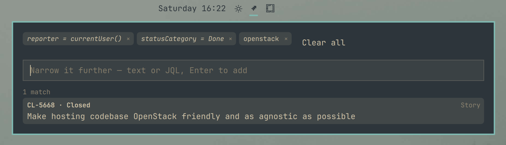

# Jira Search

[](https://github.com/tcballard/omarchy-badges)

An [Omarchy](https://omarchy.org) plugin for Jira Cloud. Search by text, by
JQL or by ticket ID, stack searches as filters that narrow one another, and
open any issue's metadata without leaving the panel. The search window opens
centered on screen, spotlight style.

It is a keyboard launcher, not a bar widget: nothing is added to the bar, and
the window is summoned by keybinding.



## Requirements

- Omarchy 4 with Quattro shell-plugin support.
- `curl`.
- Optional: `secret-tool` (`libsecret`) and a running Secret Service such as
  gnome-keyring, to keep the API token in the system keyring.
- A Jira Cloud site reachable over https, and an Atlassian API token.

The plugin talks only to the configured Jira site. It launches `bash`, `curl`
and, when present, `secret-tool` and `timeout`; it writes only to
`~/.config/omarchy/jira-search` and the keyring entry described under
[Credentials and storage](#credentials-and-storage). No third-party code is
bundled.

## Install

```bash
omarchy plugin add https://github.com/anavarre/omarchy-jira-search.git --enable
```

From a local checkout:

```bash
omarchy plugin add "$(pwd)" --enable
```

## Update

```bash
omarchy plugin update anavarre.jira-search
```

Release notes are in [CHANGELOG.md](CHANGELOG.md).

### Keybinding

The plugin has no bar icon, so a keybinding is the only way in. Add one to
`~/.config/hypr/bindings.lua`:

```lua
o.bind("SUPER + SHIFT + J", "Jira Search", "omarchy-shell shell summon anavarre.jira-search '{}'")
```

Hyprland picks the change up on save; `SUPER + SHIFT + J` then opens the panel
with the field already focused.

The payload can also fill the field in, as if the text had been typed —
handy for a binding that jumps straight to a project or a ticket:

```lua
o.bind("SUPER + SHIFT + K", "Jira: ABC", [[omarchy-shell shell summon anavarre.jira-search '{"query": "project = ABC"}']])
```

Only `query` is read; it is flattened to one line and capped at 500
characters. Anything that is not a JSON object opens the panel as `'{}'` does.

## Connect

Open the panel and fill in **Site**, **Account email** and **API token**, then
*Save and connect*. Credentials are checked against the Jira API right away.
Create a token at
<https://id.atlassian.com/manage-profile/security/api-tokens>.

Once connected, the panel shows the signed-in account, with **Change
credentials** to update it and **Forget** to delete what was stored.

## Usage

Press `SUPER + SHIFT + J` (or run
`omarchy-shell shell summon anavarre.jira-search '{}'`) and start typing. The
window opens in the middle of the screen; click anywhere outside it or press
`ESC` to close it.

| Input | What happens |
| --- | --- |
| Three or more characters | Searches as you type (300 ms after you stop) and lists up to 20 tickets, most recently updated first |
| **Enter** | Pins what you typed as a filter chip and empties the field, so the next thing you type narrows the same list |
| A full ticket ID (`ABC-123`, any case), with no filters pinned | Skips the list and shows that issue's metadata, so you can see what it is before leaving |
| JQL (`status = Done`, `updated >= -7d`, `ORDER BY created DESC`) | Sent to Jira verbatim — press **Enter** to add it as a filter |
| **?** next to the field (or **?** / **F1** on the keyboard) | Lists common JQL — `project = "ABC"`, `reporter = currentUser()`, `sprint IN openSprints()` and more. Pick one to put it in the field, then **Enter** to add it |

### Stacking filters

Every search you submit stays on screen as a chip, and the panel ANDs the chips
together into one JQL query. Search `open web` and press Enter; the chip
appears and the field clears. Type `project = WEB` and press Enter, and the
list is now every HAAS ticket mentioning open web:

```
text ~ "\"open web\"" AND (project = WEB) ORDER BY updated DESC
```

Keep going and each one narrows further. Whatever is still half-typed in the
field counts as one more filter while it is there, so the list moves as you
type and settles when you submit.

Text filters match the **exact phrase**, in order. The doubled quotes above
are the reason: JQL's own quotes only delimit a string, and Lucene then splits
what is inside into separate, stemmed words — `text ~ "open web"` also
returns a ticket that says "webinar" somewhere and "evolve" somewhere else.
The escaped inner pair is what Lucene reads as a phrase. Note that `text`
covers the summary, description **and comments**, so a match may be in a
comment rather than anywhere visible on the card.

Take a chip back out by clicking it, or by pressing **Backspace** in an empty
field to drop the last one. **Clear all** appears once there are two or more.
Filters are text or JQL, mixed freely; JQL chips are shown in italics and are
parenthesised before they are ANDed, so their own `OR`s cannot leak. A `ORDER
BY` in any chip sets the sort for the whole query; otherwise it is
`ORDER BY updated DESC`.

JQL is detected automatically (a field followed by an operator, a shape such as
`assignee in (currentUser())`, or a bare sort). Because half-written JQL is a
syntax error, JQL queries wait for Enter rather than searching as you type, and
the field tells you so. Prose still works — `what is broken` stays a text
search.

### Keys

- **Up/Down** highlight a result, **Enter** (or a click) opens it in your
  browser straight away — a result is a ticket you already picked, so it does
  not stop at the metadata card the way a blindly typed ticket ID does.
- On an issue card the cursor starts on **Open in browser**, so Enter opens it
  in your browser. **Left/Right** move between buttons, **Up** leaves the row.
- **Backspace** in an empty field removes the last filter chip.
- **?** in an empty field, **F1**, or the **?** button shows or hides the JQL
  examples; **Up/Down** highlight one and **Enter** puts it in the field.
- **Escape** steps back: out of the JQL examples or the button row, then from an issue to its
  results, then clears the field, then the filters, then closes the panel.

## Credentials and storage

The plugin uses the Jira Cloud REST API with
[basic auth](https://developer.atlassian.com/cloud/jira/software/basic-auth-for-rest-apis/)
and refuses to look anything up until the credentials verify against
`GET /rest/api/3/myself`. A 401 or 403 during a lookup returns you to the form
rather than showing a bare error.

The site and account are saved in `~/.config/omarchy/jira-search/config`
(`0600`, directory `0700`). The API token goes to the system keyring when
`secret-tool` (from `libsecret`) is installed and a Secret Service such as
gnome-keyring answers — it shows up in Seahorse as *Jira Search API token*.
Without one, it is saved next to the config as `token`, also `0600`. Saving to
the keyring removes an older `token` file, so no plaintext copy is left behind.

Each keyring call gives up after 5 seconds, so a locked keyring whose unlock
prompt goes unanswered falls back to the file rather than hanging the panel.

The token field is masked, is never read back into the UI, and reaches
`secret-tool` and `curl` on stdin — it never shows up in `ps` or in an argv.
Leaving the token field blank keeps the token already stored.

Environment variables and an existing `jira` CLI config still win where set, so
a current setup keeps working untouched:

| What | Resolution order |
| --- | --- |
| Site | `$JIRA_SERVER` → saved `config` → `server:` in `~/.config/.jira/.config.yml` |
| Account | `$JIRA_EMAIL` → saved `config` → `login:` in `~/.config/.jira/.config.yml` |
| API token | `$JIRA_API_TOKEN` → keyring → saved `token` file → `~/.jira-api-token` |

The plugin's shell does not inherit `~/.bashrc`, so a `$JIRA_API_TOKEN`
exported there is invisible to it — that is what the form is for. The `jira`
CLI itself is not required; only its config file is read, if present.

## Uninstall

```bash
omarchy plugin disable anavarre.jira-search
omarchy plugin remove anavarre.jira-search --yes
omarchy-shell shell rescanPlugins
```

`disable` turns the plugin off; `remove` deletes
`~/.config/omarchy/plugins/anavarre.jira-search`.

That leaves your credentials on disk. To remove those too — or use **Forget**
in the panel before uninstalling:

```bash
rm -rf ~/.config/omarchy/jira-search
secret-tool clear service anavarre.jira-search kind api-token
```

Also drop the `o.bind(...)` line from `~/.config/hypr/bindings.lua` if you
added one.

## Development

```bash
./tests/run
```

Checks the manifest, then runs the Model.js unit tests and the shell commands
it builds under Node's test runner. The commands run against fakes for
`curl`, `secret-tool` and `timeout` in `tests/fakes`, in a throwaway `HOME`,
so no test reads real credentials, touches the keyring or reaches the network.
Fixtures in `tests/fixtures` are fictional. Needs `bash`, `python3` and Node
18 or later; CI runs the same script on every push and pull request.

## Compatibility

Supported target: Omarchy 4 with Quattro shell plugins, Jira Cloud (REST API
v3). Quattro's plugin contract is still evolving, so each release records the
exact Omarchy version and plugin commit it was checked on in
[CHANGELOG.md](CHANGELOG.md); anything not listed there is untested. Jira
Server and Data Center are not supported.

## Support

Report bugs and ask questions in
[GitHub issues](https://github.com/anavarre/omarchy-jira-search/issues).
Include the Omarchy version, the plugin commit (`git -C
~/.config/omarchy/plugins/anavarre.jira-search rev-parse HEAD`) and what the
panel showed — never an API token.

## Security

Omarchy plugins run as unsandboxed code inside `omarchy-shell`, with your
user's access to files and the network. Review this repository before enabling
it.

Report a vulnerability privately through
[GitHub security advisories](https://github.com/anavarre/omarchy-jira-search/security/advisories/new),
not in a public issue. Passing `omarchy plugin validate` or a marketplace scan
is limited static evidence, not a security audit.

## License

MIT © Aurelien Navarre. See [LICENSE](LICENSE).
